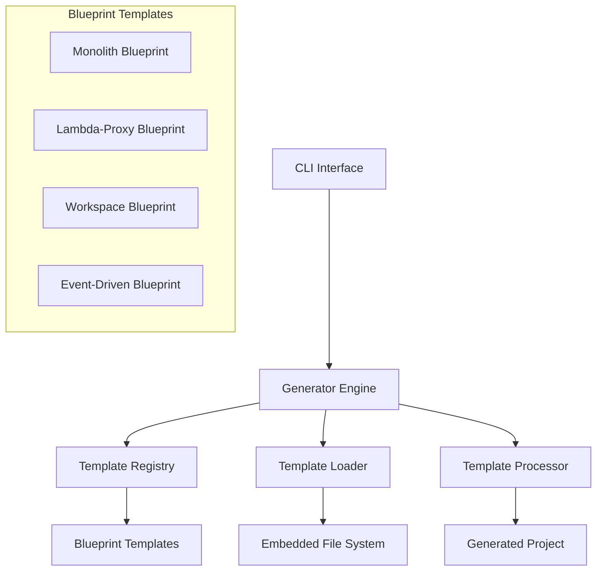
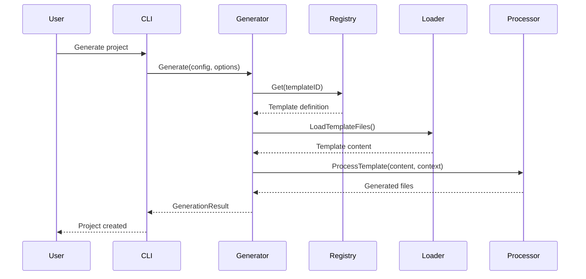

# Design Document

## Overview

This design document outlines the implementation of the remaining Phase 2 blueprints for the go-starter project generator. The system is a comprehensive Go project scaffolding tool that generates production-ready project templates with various architectural patterns. Currently at 77% completion (10/13 blueprints), this feature will complete the remaining 4 blueprints to achieve 100% Phase 2 completion.

The go-starter system follows a template-based architecture where blueprints are defined as YAML configurations with associated Go template files. The system uses a registry pattern to manage templates, a generator engine to process templates, and supports conditional file generation, dependency management, and post-generation hooks.

## Architecture

### System Architecture Overview



### Template Processing Flow



## Components and Interfaces

### 1. Blueprint Template Structure

Each blueprint follows a standardized structure:

```yaml
name: blueprint-name
description: Blueprint description
type: blueprint-type
architecture: architecture-pattern
version: 1.0.0
variables: []      # Template variables
files: []          # File definitions
dependencies: []   # Go module dependencies
post_hooks: []     # Post-generation commands
```

### 2. Template Registry Interface

The registry manages all available blueprints:

```go
type Registry interface {
    Register(template types.Template) error
    Get(templateID string) (types.Template, error)
    List() []types.Template
    GetByType(templateType string) []types.Template
    Exists(templateID string) bool
}
```

### 3. Generator Interface

The generator processes templates and creates projects:

```go
type Generator interface {
    Generate(config types.ProjectConfig, options types.GenerationOptions) (*types.GenerationResult, error)
    GenerateInMemory(config *types.ProjectConfig, blueprintID string) (map[string][]byte, error)
    Preview(config types.ProjectConfig, outputDir string) error
}
```

### 4. Template Processing Context

Each template receives a comprehensive context for variable substitution:

```go
type TemplateContext struct {
    ProjectName  string
    ModulePath   string
    GoVersion    string
    Framework    string
    Architecture string
    Author       string
    Email        string
    License      string
    Variables    map[string]interface{}
    Features     FeatureConfig
}
```

## Data Models

### 1. Blueprint Configuration Model

```go
type Template struct {
    ID           string
    Name         string
    Description  string
    Type         string
    Architecture string
    Version      string
    Variables    []Variable
    Files        []FileDefinition
    Dependencies []Dependency
    PostHooks    []Hook
    Metadata     map[string]interface{}
}
```

### 2. File Definition Model

```go
type FileDefinition struct {
    Source      string  // Template file path
    Destination string  // Output file path (supports templating)
    Condition   string  // Optional condition for inclusion
    Executable  bool    // Whether file should be executable
}
```

### 3. Variable Definition Model

```go
type Variable struct {
    Name        string
    Description string
    Type        string
    Required    bool
    Default     interface{}
    Options     []string
    Validation  string
}
```

## Blueprint Implementations

### 1. Monolith Blueprint Completion

**Status**: 98% complete, needs final components

**Missing Components**:
- Additional controller files (user.go, api.go)
- Test files (home_test.go, auth_test.go, integration_test.go, helpers.go)
- Script files (setup.sh, migrate.sh)
- Build configuration files (go.mod, README.md, .gitignore, etc.)
- CI/CD workflow files

**Architecture Pattern**: Traditional MVC monolithic web application

**Key Features**:
- Multi-framework support (Gin, Echo, Fiber, Chi)
- Multiple database drivers (PostgreSQL, MySQL, SQLite)
- Authentication systems (Session, JWT, OAuth2)
- Template engines (html/template, Pongo2, Jet)
- Asset pipeline options (Embedded, Webpack, Vite, ESBuild)

### 2. Lambda-Proxy Blueprint

**Status**: 0% complete, full implementation needed

**Architecture Pattern**: AWS Lambda with API Gateway proxy integration

**Core Components**:

```
lambda-proxy/
├── main.go.tmpl                    # Lambda entry point
├── handler/
│   ├── proxy.go.tmpl              # API Gateway proxy handler
│   ├── middleware.go.tmpl         # Middleware chain
│   └── response.go.tmpl           # Response formatting
├── routes/
│   ├── api.go.tmpl                # Route definitions
│   └── handlers.go.tmpl           # HTTP handlers
├── controllers/
│   ├── health.go.tmpl             # Health check endpoint
│   ├── users.go.tmpl              # User CRUD operations
│   └── auth.go.tmpl               # Authentication endpoints
├── auth/
│   ├── jwt.go.tmpl                # JWT token handling
│   ├── authorizer.go.tmpl         # API Gateway authorizer
│   └── middleware.go.tmpl         # Auth middleware
├── aws/
│   ├── dynamodb.go.tmpl           # DynamoDB integration
│   ├── s3.go.tmpl                 # S3 file operations
│   ├── ses.go.tmpl                # Email service
│   └── cloudwatch.go.tmpl         # Logging and metrics
├── terraform/
│   ├── main.tf.tmpl               # Core infrastructure
│   ├── api-gateway.tf.tmpl        # API Gateway configuration
│   ├── lambda.tf.tmpl             # Lambda function setup
│   └── variables.tf.tmpl          # Configuration variables
├── serverless.yml.tmpl            # Serverless Framework config
├── sam.yaml.tmpl                  # AWS SAM template
└── tests/
    ├── integration_test.go.tmpl   # API integration tests
    └── lambda_test.go.tmpl        # Lambda function tests
```

**Key Features**:
- API Gateway proxy event handling
- Multiple IaC options (Terraform, Serverless, SAM)
- AWS service integrations (DynamoDB, S3, SES, CloudWatch)
- JWT authentication with custom authorizers
- Cold start optimization
- Structured logging and monitoring

### 3. Workspace Blueprint

**Status**: 0% complete, full implementation needed

**Architecture Pattern**: Go multi-module workspace (monorepo)

**Core Components**:

```
workspace/
├── go.work.tmpl                   # Go workspace file
├── go.work.sum.tmpl               # Workspace checksums
├── Makefile.tmpl                  # Build orchestration
├── workspace.yaml.tmpl            # Custom workspace metadata
├── cmd/
│   ├── api/                       # Web API service
│   ├── cli/                       # CLI tool
│   └── worker/                    # Background worker
├── pkg/
│   ├── shared/                    # Shared libraries
│   ├── models/                    # Common data models
│   └── utils/                     # Utility functions
├── internal/
│   ├── auth/                      # Authentication service
│   └── storage/                   # Storage abstraction
├── services/
│   ├── user-service/              # User management service
│   └── notification-service/      # Notification service
├── scripts/
│   ├── build-all.sh.tmpl          # Build all modules
│   ├── test-all.sh.tmpl           # Test all modules
│   ├── lint-all.sh.tmpl           # Lint all modules
│   └── release.sh.tmpl            # Release management
├── tools/
│   ├── tools.go.tmpl              # Development tools
│   └── generate.go.tmpl           # Code generation
└── docs/
    ├── architecture.md.tmpl       # Architecture overview
    ├── modules.md.tmpl            # Module documentation
    └── development.md.tmpl        # Development guide
```

**Key Features**:
- Multi-module dependency management
- Unified build system with parallel builds
- Cross-module code generation
- Service-oriented architecture
- Comprehensive documentation system

### 4. Event-Driven Blueprint

**Status**: 0% complete, full implementation needed

**Architecture Pattern**: CQRS/Event Sourcing with message-driven architecture

**Core Components**:

```
event-driven/
├── eventstore/
│   ├── store.go.tmpl              # Event store interface
│   ├── memory.go.tmpl             # In-memory implementation
│   ├── postgres.go.tmpl           # PostgreSQL implementation
│   └── stream.go.tmpl             # Event stream handling
├── events/
│   ├── base.go.tmpl               # Base event types
│   ├── user.go.tmpl               # User domain events
│   └── versioning.go.tmpl         # Event versioning
├── commands/
│   ├── base.go.tmpl               # Command interface
│   ├── user.go.tmpl               # User commands
│   └── handlers.go.tmpl           # Command handlers
├── queries/
│   ├── base.go.tmpl               # Query interface
│   ├── user.go.tmpl               # User queries
│   └── handlers.go.tmpl           # Query handlers
├── projections/
│   ├── user.go.tmpl               # User projections
│   └── materialized.go.tmpl       # Materialized views
├── domain/
│   ├── aggregate.go.tmpl          # Aggregate root
│   ├── user/
│   │   ├── aggregate.go.tmpl      # User aggregate
│   │   ├── events.go.tmpl         # User events
│   │   └── commands.go.tmpl       # User commands
│   └── repository.go.tmpl         # Repository interface
├── bus/
│   ├── command.go.tmpl            # Command bus
│   ├── event.go.tmpl              # Event bus
│   ├── query.go.tmpl              # Query bus
│   └── middleware.go.tmpl         # Bus middleware
├── messaging/
│   ├── nats.go.tmpl               # NATS integration
│   ├── kafka.go.tmpl              # Kafka integration
│   └── redis.go.tmpl              # Redis pub/sub
├── sagas/
│   ├── base.go.tmpl               # Saga base types
│   ├── user-registration.go.tmpl  # User registration saga
│   └── orchestrator.go.tmpl       # Saga orchestrator
├── api/
│   ├── commands.go.tmpl           # Command API endpoints
│   ├── queries.go.tmpl            # Query API endpoints
│   └── websockets.go.tmpl         # Real-time updates
└── graphql/
    ├── schema.go.tmpl             # GraphQL schema
    └── resolvers.go.tmpl          # GraphQL resolvers
```

**Key Features**:
- Event sourcing with multiple storage backends
- CQRS pattern implementation
- Domain-driven design with aggregates
- Message bus abstraction
- Saga pattern for distributed transactions
- Multiple API interfaces (REST, GraphQL, WebSocket)

## Error Handling

### Template Processing Errors

```go
type TemplateError struct {
    Type        string
    Message     string
    TemplateID  string
    FilePath    string
    LineNumber  int
    Cause       error
}
```

### Generation Transaction Rollback

The system implements transaction-like behavior for project generation:

```go
type GenerationTransaction struct {
    outputPath    string
    filesCreated  []string
    dirsCreated   []string
    hooksExecuted []string
}

func (tx *GenerationTransaction) Rollback() error {
    // Remove created files and directories in reverse order
    // Log rollback operations
    // Return aggregated errors
}
```

### Error Recovery Strategies

1. **Template Parse Errors**: Validate templates during registration
2. **File System Errors**: Implement rollback on generation failure
3. **Dependency Errors**: Graceful degradation with warnings
4. **Hook Execution Errors**: Non-fatal warnings, continue generation

## Testing Strategy

### Unit Testing

- Template parsing and validation
- Context creation and variable substitution
- File generation logic
- Registry operations
- Error handling scenarios

### Integration Testing

- End-to-end project generation
- Template file processing
- Dependency installation
- Hook execution
- Generated project compilation

### Blueprint Testing

Each blueprint will include:
- Template validation tests
- Generated project compilation tests
- Feature-specific functionality tests
- Security and performance tests

### Test Structure

```go
func TestBlueprintGeneration(t *testing.T) {
    tests := []struct {
        name     string
        config   types.ProjectConfig
        expected []string // Expected files
        validate func(t *testing.T, outputPath string)
    }{
        // Test cases for each blueprint
    }
}
```

## Security Considerations

### Template Security

- Input validation for all template variables
- Sanitization of user-provided values
- Path traversal prevention in file destinations
- Template injection prevention

### Generated Code Security

- OWASP Top 10 compliance in generated applications
- Secure defaults for authentication and authorization
- Input validation in generated controllers
- SQL injection prevention in database code
- XSS prevention in HTML templates

### Dependency Security

- Vulnerability scanning of template dependencies
- Version pinning for security updates
- Regular dependency updates
- Security advisory monitoring

## Performance Optimization

### Template Processing

- Template compilation caching
- Parallel file processing
- Efficient memory usage for large templates
- Streaming for large file generation

### Generated Project Performance

- Optimized database queries in generated code
- Efficient asset bundling
- Caching strategies implementation
- Performance monitoring integration

## Monitoring and Observability

### Generation Metrics

- Template usage statistics
- Generation success/failure rates
- Performance metrics (generation time, file count)
- Error frequency and types

### Generated Application Monitoring

- Built-in logging configuration
- Metrics collection setup
- Health check endpoints
- Distributed tracing support (where applicable)

## Documentation Strategy

### Blueprint Documentation

Each blueprint includes:
- Architecture overview
- Feature documentation
- Configuration options
- Usage examples
- Troubleshooting guide

### Generated Project Documentation

- README with setup instructions
- API documentation (where applicable)
- Development guide
- Deployment instructions
- Contributing guidelines

## Quality Assurance

### Code Quality Standards

- Go formatting and linting
- Test coverage requirements (>80%)
- Security scanning
- Performance benchmarking
- Documentation completeness

### Blueprint Quality Metrics

- Compilation success rate
- Feature completeness score
- Security compliance score
- Performance benchmark results
- User experience rating

### Continuous Integration

- Automated testing on multiple Go versions
- Cross-platform compatibility testing
- Security vulnerability scanning
- Performance regression testing
- Documentation generation and validation