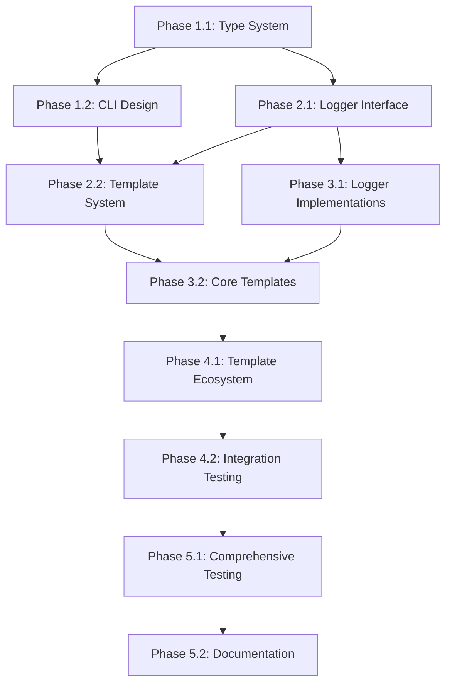

# Logger Selector Implementation Plan

## Overview
This document outlines the comprehensive plan for implementing logger selector support in the Go project generator, allowing users to choose between different logging libraries while maintaining slog as the default selection.

## Implementation Phases

### Phase 1: Foundation & Design (Week 1)
**Goal**: Establish the foundation for logger selector support without breaking existing functionality.

#### Phase 1.1: Type System & Configuration Design
**Deliverables:**
- [ ] Update `pkg/types/project.go` with LoggingConfig struct
- [ ] Design logger interface specification
- [ ] Define template variable structure
- [ ] Create configuration schema

**Tasks:**
1. Add LoggingConfig to Features struct
2. Define logger interface contract
3. Plan template variable naming convention
4. Design configuration file structure

**Acceptance Criteria:**
- Types compile without errors
- Configuration structure supports all 4 loggers
- Interface design is extensible for future loggers

#### Phase 1.2: CLI Integration Design
**Deliverables:**
- [ ] Logger selection prompt design
- [ ] Integration with existing prompt flow
- [ ] Advanced/basic mode handling

**Tasks:**
1. Design prompt questions and options
2. Plan integration with existing prompts
3. Define default behaviors
4. Create prompt validation logic

**Acceptance Criteria:**
- Prompts integrate seamlessly with existing flow
- Default selection works without user input
- Advanced mode provides full logger configuration

### Phase 2: Core Infrastructure (Week 2)
**Goal**: Implement the core logger infrastructure and template system changes.

#### Phase 2.1: Logger Interface Implementation
**Deliverables:**
- [ ] Logger interface template (`internal/logger/interface.go.tmpl`)
- [ ] Logger factory template (`internal/logger/factory.go.tmpl`)
- [ ] slog implementation template (`internal/logger/slog.go.tmpl`)
- [ ] Basic test framework for logger implementations

**Tasks:**
1. Create logger interface with consistent API
2. Implement factory pattern for logger creation
3. Create slog implementation as reference
4. Add basic unit tests

**Acceptance Criteria:**
- Interface provides consistent API across all loggers
- Factory correctly instantiates loggers based on configuration
- slog implementation passes all interface tests
- Generated code compiles and runs

#### Phase 2.2: Template System Updates
**Deliverables:**
- [ ] Updated `template.yaml` with logger variables
- [ ] Conditional file generation logic
- [ ] Dependency management for different loggers
- [ ] CLI prompt implementation

**Tasks:**
1. Add logger variables to template.yaml
2. Implement conditional file generation
3. Update dependency management
4. Integrate prompts into CLI

**Acceptance Criteria:**
- Template generation works with logger selection
- Dependencies are correctly included based on logger choice
- CLI prompts work in both basic and advanced modes
- Backward compatibility maintained

### Phase 3: Logger Implementations (Week 3)
**Goal**: Implement all supported logger types and update core application templates.

#### Phase 3.1: Additional Logger Implementations
**Deliverables:**
- [ ] Zap implementation template (`internal/logger/zap.go.tmpl`)
- [ ] Logrus implementation template (`internal/logger/logrus.go.tmpl`)
- [ ] Zerolog implementation template (`internal/logger/zerolog.go.tmpl`)
- [ ] Comprehensive logger tests

**Tasks:**
1. Implement zap logger adapter
2. Implement logrus logger adapter
3. Implement zerolog logger adapter
4. Create comprehensive test suite for all loggers

**Acceptance Criteria:**
- All logger implementations pass interface tests
- Performance benchmarks meet expectations
- Error handling is consistent across implementations
- Configuration options work for all loggers

#### Phase 3.2: Core Application Template Updates
**Deliverables:**
- [ ] Updated `cmd/server/main.go.tmpl` with logger factory
- [ ] Updated middleware templates to use logger interface
- [ ] Updated database templates with structured logging
- [ ] Configuration integration

**Tasks:**
1. Replace direct slog usage with logger factory
2. Update all middleware to use logger interface
3. Standardize database logging
4. Integrate with configuration system

**Acceptance Criteria:**
- Main application initializes logger correctly
- All middleware uses consistent logging interface
- Database operations log structured data
- Configuration drives logger behavior

### Phase 4: Template Ecosystem (Week 4)
**Goal**: Update all templates that use logging and ensure consistency across the project.

#### Phase 4.1: Template-wide Logging Updates
**Deliverables:**
- [ ] Updated `go.mod.tmpl` with conditional dependencies
- [ ] Updated configuration templates with logging options
- [ ] Updated all service/handler templates
- [ ] Updated test templates

**Tasks:**
1. Implement conditional dependency inclusion
2. Update all configuration files
3. Standardize logging in services and handlers
4. Update test templates to use logger interface

**Acceptance Criteria:**
- Only required logger dependencies are included
- All templates use consistent logging patterns
- Configuration files have proper logging sections
- Test templates work with all logger types

#### Phase 4.2: Integration Testing & Validation
**Deliverables:**
- [ ] Comprehensive integration test suite
- [ ] Template generation validation for all logger types
- [ ] Performance benchmarking
- [ ] Documentation updates

**Tasks:**
1. Create integration tests for each logger type
2. Validate generated projects compile and run
3. Benchmark template generation performance
4. Update project documentation

**Acceptance Criteria:**
- All logger combinations generate working projects
- Generated projects pass compilation and basic tests
- Template generation performance is acceptable
- Documentation is complete and accurate

### Phase 5: Testing & Polish (Week 5)
**Goal**: Comprehensive testing, bug fixes, and final polish.

#### Phase 5.1: Comprehensive Testing
**Deliverables:**
- [ ] Unit tests for all components (>90% coverage)
- [ ] Integration tests for all logger combinations
- [ ] End-to-end CLI testing
- [ ] Performance validation

**Tasks:**
1. Achieve comprehensive test coverage
2. Test all logger combinations thoroughly
3. Validate CLI user experience
4. Performance testing and optimization

**Acceptance Criteria:**
- Test coverage exceeds 90%
- All logger combinations work correctly
- CLI provides smooth user experience
- Performance meets benchmarks

#### Phase 5.2: Documentation & Examples
**Deliverables:**
- [ ] Updated README with logger selection examples
- [ ] Logger comparison documentation
- [ ] Migration guide for existing projects
- [ ] Example configurations

**Tasks:**
1. Update project README
2. Create logger comparison guide
3. Write migration documentation
4. Provide example configurations

**Acceptance Criteria:**
- Documentation is comprehensive and clear
- Examples work and are tested
- Migration path is well-documented
- User experience is smooth

## Phase Dependencies

## Milestone Deliverables

### Milestone 1: Foundation Complete (End of Week 1)
- Type system supports logger configuration
- CLI prompts designed and integrated
- Interface specification defined
- Basic infrastructure in place

### Milestone 2: Core Infrastructure (End of Week 2)
- Logger interface and factory implemented
- Template system supports conditional generation
- slog implementation working
- CLI prompts functional

### Milestone 3: Full Logger Support (End of Week 3)
- All 4 logger types implemented
- Core application templates updated
- Basic integration testing passing
- Main functionality complete

### Milestone 4: Complete Template Ecosystem (End of Week 4)
- All templates use consistent logging
- Conditional dependencies working
- Comprehensive integration tests
- Feature complete

### Milestone 5: Production Ready (End of Week 5)
- Comprehensive testing complete
- Documentation finished
- Performance validated
- Ready for release

## Risk Management by Phase

### Phase 1 Risks
- **Risk**: Interface design doesn't accommodate all loggers
- **Mitigation**: Research all logger APIs before finalizing interface

### Phase 2 Risks
- **Risk**: Template conditional logic becomes too complex
- **Mitigation**: Keep conditions simple, use clear naming

### Phase 3 Risks
- **Risk**: Logger implementations don't meet performance expectations
- **Mitigation**: Benchmark early, optimize iteratively

### Phase 4 Risks
- **Risk**: Template updates break existing functionality
- **Mitigation**: Comprehensive regression testing

### Phase 5 Risks
- **Risk**: Integration issues discovered late
- **Mitigation**: Continuous integration testing throughout phases

## Success Criteria by Phase

### Phase 1 Success
- [x] Type system compiles
- [x] CLI integration designed
- [x] Interface specification complete

### Phase 2 Success
- [ ] Basic logger selection works
- [ ] Template generation functional
- [ ] slog implementation working

### Phase 3 Success
- [ ] All 4 loggers implemented
- [ ] Core templates updated
- [ ] Integration tests passing

### Phase 4 Success
- [ ] All templates consistent
- [ ] Dependencies conditional
- [ ] Full feature set working

### Phase 5 Success
- [ ] >90% test coverage
- [ ] Documentation complete
- [ ] Performance validated
- [ ] Production ready

## Current State Analysis

### Existing Logging Implementation
- **Primary Logger**: Standard library `log/slog` with JSON handler
- **Mixed Usage**: Some components still use basic `log` package
- **Configuration**: Basic logging config exists (`level`, `format`)
- **Dependencies**: `go.uber.org/zap v1.26.0` listed but unused
- **Templates Affected**: 6 core files use logging directly

### Files Currently Using Logging
| File | Logger Type | Usage Pattern | Phase to Update |
|------|-------------|---------------|-----------------|
| `cmd/server/main.go.tmpl` | `slog` | Application lifecycle | Phase 3.2 |
| `internal/middleware/logger.go.tmpl` | `slog` | HTTP request logging | Phase 3.2 |
| `internal/middleware/recovery.go.tmpl` | `slog` | Panic recovery | Phase 3.2 |
| `internal/database/connection.go.tmpl` | `log` | Basic connection logging | Phase 4.1 |
| `internal/database/migrations.go.tmpl` | `log` | Migration progress | Phase 4.1 |
| `tests/integration/api_test.go.tmpl` | Middleware | Indirect usage | Phase 4.1 |

## Logger-Specific Implementation Details

### Supported Loggers
| Logger | Package | Version | Use Case | Implementation Phase |
|--------|---------|---------|----------|---------------------|
| **slog** | `log/slog` | stdlib | Default, structured logging | Phase 2.1 |
| **zap** | `go.uber.org/zap` | v1.26.0 | High performance | Phase 3.1 |
| **logrus** | `github.com/sirupsen/logrus` | v1.9.3 | Popular, feature-rich | Phase 3.1 |
| **zerolog** | `github.com/rs/zerolog` | v1.31.0 | Zero allocation | Phase 3.1 |

## Next Steps

1. **Start Phase 1.1**: Update type system with LoggingConfig
2. **Design Review**: Review interface design with team
3. **Prototype**: Create basic logger interface prototype
4. **Validate**: Test interface with slog implementation

This phased approach ensures steady progress while maintaining project quality and minimizing risk of breaking changes.