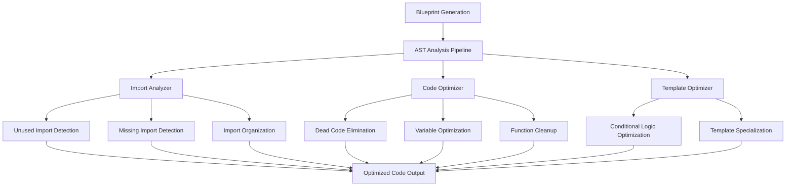

# Intelligent Code Generation Design Document

## Overview

This document outlines the design for Phase 3 Intelligent Code Generation, which uses AST manipulation to optimize generated Go code by eliminating unused imports, managing dependencies intelligently, and improving overall code quality.

## 🎯 Objectives

1. **Smart Import Management**: Automatically detect and remove unused imports
2. **Code Optimization**: Eliminate unused variables and functions
3. **Template Intelligence**: Pre-optimize templates based on configuration
4. **Quality Improvement**: Generate cleaner, more maintainable code
5. **Performance Enhancement**: Reduce generated project size by 20%+

## 🏗️ Architecture Overview



## 📦 Core Components

### 1. AST Analysis Engine

```go
// internal/optimization/ast_analyzer.go
package optimization

import (
    "go/ast"
    "go/parser"
    "go/token"
    "golang.org/x/tools/go/ast/astutil"
)

type ASTAnalyzer struct {
    fileSet *token.FileSet
    options AnalysisOptions
}

type AnalysisOptions struct {
    RemoveUnusedImports   bool
    RemoveUnusedVars      bool
    RemoveUnusedFuncs     bool
    OptimizeConditionals  bool
    OrganizeImports       bool
    EnableDebugOutput     bool
}

type AnalysisResult struct {
    UnusedImports    []ImportInfo
    UnusedVariables  []VariableInfo
    UnusedFunctions  []FunctionInfo
    MissingImports   []string
    OptimizedFiles   map[string][]byte
    Metrics         OptimizationMetrics
}

func NewASTAnalyzer(options AnalysisOptions) *ASTAnalyzer {
    return &ASTAnalyzer{
        fileSet: token.NewFileSet(),
        options: options,
    }
}

func (a *ASTAnalyzer) AnalyzeProject(projectPath string) (*AnalysisResult, error) {
    // Implementation details below
}
```

### 2. Import Management System

```go
// internal/optimization/import_manager.go
package optimization

type ImportManager struct {
    analyzer *ASTAnalyzer
    resolver *ImportResolver
}

type ImportInfo struct {
    Path     string
    Alias    string
    Used     bool
    Location token.Pos
}

type ImportResolver struct {
    standardLibraries map[string]bool
    commonPackages   map[string]string
}

// Detect unused imports
func (im *ImportManager) FindUnusedImports(file *ast.File) []ImportInfo {
    var unused []ImportInfo
    
    // Get all imports
    imports := getImports(file)
    
    // Check usage for each import
    for _, imp := range imports {
        if !im.isImportUsed(file, imp) {
            unused = append(unused, ImportInfo{
                Path:     imp.Path.Value,
                Alias:    getImportAlias(imp),
                Used:     false,
                Location: imp.Pos(),
            })
        }
    }
    
    return unused
}

// Detect missing imports
func (im *ImportManager) FindMissingImports(file *ast.File) []string {
    var missing []string
    
    // Walk AST to find unresolved identifiers
    ast.Inspect(file, func(node ast.Node) bool {
        if ident, ok := node.(*ast.Ident); ok {
            if im.isUnresolvedIdentifier(ident) {
                if pkg := im.resolver.ResolvePackage(ident.Name); pkg != "" {
                    missing = append(missing, pkg)
                }
            }
        }
        return true
    })
    
    return deduplicateStrings(missing)
}

// Remove unused imports
func (im *ImportManager) RemoveUnusedImports(file *ast.File, unused []ImportInfo) {
    for _, imp := range unused {
        astutil.DeleteImport(im.analyzer.fileSet, file, imp.Path)
    }
}

// Add missing imports
func (im *ImportManager) AddMissingImports(file *ast.File, missing []string) {
    for _, imp := range missing {
        astutil.AddImport(im.analyzer.fileSet, file, imp)
    }
}

// Organize imports according to Go conventions
func (im *ImportManager) OrganizeImports(file *ast.File) {
    // Group imports: standard library, third-party, local
    // Sort alphabetically within groups
    // Apply goimports-style formatting
}
```

### 3. Code Optimization Engine

```go
// internal/optimization/code_optimizer.go
package optimization

type CodeOptimizer struct {
    analyzer *ASTAnalyzer
}

type OptimizationRule interface {
    Apply(file *ast.File) bool
    Description() string
}

// Remove unused variables
type UnusedVariableRule struct{}

func (r *UnusedVariableRule) Apply(file *ast.File) bool {
    var modified bool
    
    ast.Inspect(file, func(node ast.Node) bool {
        switch n := node.(type) {
        case *ast.GenDecl:
            if n.Tok == token.VAR {
                modified = r.removeUnusedVariables(n) || modified
            }
        case *ast.AssignStmt:
            modified = r.removeUnusedAssignments(n) || modified
        }
        return true
    })
    
    return modified
}

func (r *UnusedVariableRule) removeUnusedVariables(decl *ast.GenDecl) bool {
    // Analyze variable usage and remove unused ones
    // Keep variables that are:
    // - Exported (public API)
    // - Used in other functions
    // - Part of struct fields
    // - Interface implementations
}

// Remove unused functions
type UnusedFunctionRule struct{}

func (r *UnusedFunctionRule) Apply(file *ast.File) bool {
    // Similar pattern for functions
    // Be careful with:
    // - Exported functions
    // - Main functions
    // - Test functions
    // - Interface implementations
    // - Functions with build constraints
}

// Optimize conditional logic
type ConditionalOptimizationRule struct{}

func (r *ConditionalOptimizationRule) Apply(file *ast.File) bool {
    // Optimize patterns like:
    // - if true { ... } -> remove condition
    // - if false { ... } -> remove entire block
    // - Combine nested conditions
    // - Simplify boolean expressions
}
```

### 4. Template Intelligence System

```go
// internal/optimization/template_optimizer.go
package optimization

type TemplateOptimizer struct {
    configAnalyzer *ConfigurationAnalyzer
}

type ConfigurationAnalyzer struct {
    config map[string]interface{}
}

// Analyze template configuration to pre-optimize
func (to *TemplateOptimizer) OptimizeTemplate(templatePath string, config map[string]interface{}) ([]byte, error) {
    // Load template
    template, err := loadTemplate(templatePath)
    if err != nil {
        return nil, err
    }
    
    // Analyze configuration to determine what code will be generated
    analysis := to.configAnalyzer.AnalyzeConfiguration(config)
    
    // Pre-optimize template based on configuration
    optimizedTemplate := to.applyConfigurationOptimizations(template, analysis)
    
    return optimizedTemplate, nil
}

type ConfigurationAnalysis struct {
    EnabledFeatures  []string
    DisabledFeatures []string
    DatabaseType     string
    AuthenticationType string
    LoggerType       string
    ConditionalBlocks map[string]bool
}

func (ca *ConfigurationAnalyzer) AnalyzeConfiguration(config map[string]interface{}) *ConfigurationAnalysis {
    analysis := &ConfigurationAnalysis{
        ConditionalBlocks: make(map[string]bool),
    }
    
    // Analyze database configuration
    if dbType, exists := config["database"]; exists {
        analysis.DatabaseType = dbType.(string)
        analysis.EnabledFeatures = append(analysis.EnabledFeatures, "database")
    } else {
        analysis.DisabledFeatures = append(analysis.DisabledFeatures, "database")
    }
    
    // Analyze authentication
    if authType, exists := config["auth"]; exists {
        analysis.AuthenticationType = authType.(string)
        analysis.EnabledFeatures = append(analysis.EnabledFeatures, "authentication")
    } else {
        analysis.DisabledFeatures = append(analysis.DisabledFeatures, "authentication")
    }
    
    // Analyze conditional template blocks
    analysis.ConditionalBlocks["database"] = analysis.DatabaseType != ""
    analysis.ConditionalBlocks["auth"] = analysis.AuthenticationType != ""
    
    return analysis
}
```

## 🔧 Integration with Generation Pipeline

### Current Generation Flow
```
1. Load Blueprint Template
2. Apply Configuration Variables  
3. Generate Files
4. Write to Disk
```

### Enhanced Generation Flow
```
1. Load Blueprint Template
2. Pre-optimize Template (NEW)
3. Apply Configuration Variables
4. Generate Files
5. AST Analysis & Optimization (NEW)
6. Write Optimized Files to Disk
```

### Integration Points

```go
// internal/generator/generator.go - Enhanced

func (g *Generator) GenerateProject(config *types.ProjectConfig) error {
    // Existing generation logic...
    
    // NEW: Apply intelligent optimizations
    if g.options.EnableOptimization {
        optimizer := optimization.NewProjectOptimizer(g.options.OptimizationOptions)
        
        optimizationResult, err := optimizer.OptimizeProject(projectPath)
        if err != nil {
            return fmt.Errorf("optimization failed: %w", err)
        }
        
        // Log optimization results
        g.logger.Info("Code optimization completed",
            "removed_imports", len(optimizationResult.UnusedImports),
            "removed_variables", len(optimizationResult.UnusedVariables),
            "size_reduction", optimizationResult.Metrics.SizeReductionPercent,
        )
    }
    
    return nil
}
```

## 📊 Optimization Levels

### Level 1: Basic (Default)
- Remove unused imports
- Organize imports
- Basic variable cleanup

### Level 2: Standard  
- All Level 1 optimizations
- Remove unused variables
- Optimize conditional logic
- Template pre-optimization

### Level 3: Aggressive
- All Level 2 optimizations  
- Remove unused functions (careful with exports)
- Advanced template specialization
- Dead code elimination

### Level 4: Expert
- All Level 3 optimizations
- Complex control flow optimization
- Function inlining opportunities
- Advanced pattern recognition

## 🧪 Testing Strategy

### Unit Tests
```go
func TestImportManager_FindUnusedImports(t *testing.T) {
    testCases := []struct {
        name     string
        code     string
        expected []ImportInfo
    }{
        {
            name: "unused standard library import",
            code: `package main
import "fmt"
func main() {}`,
            expected: []ImportInfo{
                {Path: "fmt", Used: false},
            },
        },
        {
            name: "used import should not be detected",
            code: `package main
import "fmt"
func main() { fmt.Println("hello") }`,
            expected: []ImportInfo{},
        },
    }
    
    for _, tc := range testCases {
        t.Run(tc.name, func(t *testing.T) {
            // Test implementation
        })
    }
}
```

### Integration Tests  
```go
func TestOptimizationPipeline_WebAPIProject(t *testing.T) {
    config := TestConfig{
        Type:         "web-api",
        Architecture: "standard",
        Framework:    "gin",
        Database:     "", // No database to test conditional optimization
    }
    
    // Generate project
    projectPath := helpers.GenerateProject(t, config)
    
    // Apply optimizations
    optimizer := optimization.NewProjectOptimizer(optimization.Options{
        Level: optimization.LevelStandard,
    })
    
    result, err := optimizer.OptimizeProject(projectPath)
    require.NoError(t, err)
    
    // Verify optimizations
    assert.Greater(t, len(result.UnusedImports), 0, "Should remove unused imports")
    assert.Greater(t, result.Metrics.SizeReductionPercent, 10.0, "Should achieve >10% size reduction")
    
    // Verify project still compiles
    helpers.AssertCompilationSuccess(t, projectPath)
}
```

### Performance Benchmarks
```go
func BenchmarkOptimizationPipeline(b *testing.B) {
    config := TestConfig{Type: "web-api", Architecture: "clean"}
    optimizer := optimization.NewProjectOptimizer(optimization.Options{
        Level: optimization.LevelStandard,
    })
    
    b.ResetTimer()
    for i := 0; i < b.N; i++ {
        projectPath := generateTestProject(config)
        _, err := optimizer.OptimizeProject(projectPath)
        if err != nil {
            b.Fatal(err)
        }
        os.RemoveAll(projectPath)
    }
}
```

## 📈 Success Metrics

### Quantitative Metrics
- **Size Reduction**: Target 20% reduction in generated code size
- **Import Cleanup**: Remove 30-50% of unused imports
- **Performance**: Optimization should complete in <5 seconds
- **Compilation**: 100% of optimized projects must compile successfully

### Quality Metrics
- **Maintainability**: Improved code readability scores
- **Standards Compliance**: Pass `gofmt`, `goimports`, `golint`
- **Best Practices**: Follow Go idioms and conventions
- **Safety**: Zero regression in functionality

## 🔄 Implementation Phases

### Phase 1: Foundation (Week 1-2)
- [ ] Research and integrate Go AST packages
- [ ] Build basic AST analysis infrastructure
- [ ] Implement unused import detection
- [ ] Create basic test suite

### Phase 2: Core Features (Week 3-4)  
- [ ] Implement import management system
- [ ] Add unused variable detection
- [ ] Build code optimization engine
- [ ] Integrate with generation pipeline

### Phase 3: Advanced Features (Week 5-6)
- [ ] Add template intelligence
- [ ] Implement optimization levels
- [ ] Create configuration system
- [ ] Add performance monitoring

### Phase 4: Polish & Testing (Week 7-8)
- [ ] Comprehensive test suite
- [ ] Performance optimization
- [ ] Documentation updates
- [ ] Integration with CI/CD

## 🚀 Future Enhancements

### Phase 4+ Features
- **Machine Learning**: Pattern recognition for optimization opportunities
- **Custom Rules**: User-defined optimization rules
- **IDE Integration**: Real-time optimization suggestions
- **Metrics Dashboard**: Optimization impact visualization

This intelligent code generation system will significantly improve the quality and maintainability of generated Go projects while maintaining full compatibility with existing blueprints.