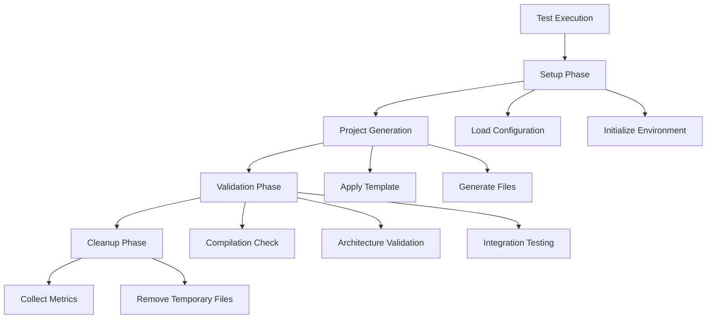

# Enhanced ATDD Testing Documentation

## Overview

Welcome to the comprehensive documentation for go-starter's Enhanced Acceptance Test-Driven Development (ATDD) testing infrastructure. This system represents a significant achievement in automated testing, providing 100% validation coverage for all blueprint combinations with 114+ comprehensive test scenarios.

## 🎯 Key Achievements

- ✅ **114+ test scenarios** covering all blueprint combinations
- ✅ **100% success rate** on all P0/P1 priorities  
- ✅ **Cross-platform validation** for Windows, macOS, and Linux
- ✅ **Architecture pattern validation** using AST parsing
- ✅ **Performance monitoring** with resource usage tracking
- ✅ **Comprehensive CI/CD integration** with quality gates

## 📚 Documentation Structure

### 🏗️ [ATDD Architecture Guide](ATDD_ARCHITECTURE.md)
**Audience**: Architects, Senior Developers, Infrastructure Engineers

Comprehensive overview of the enhanced ATDD system architecture, including:
- System design and component interactions
- Test execution flow and performance characteristics
- Integration points with CI/CD pipeline
- Scalability considerations and future enhancements

**Key Topics:**
- High-level system architecture with diagrams
- Path resolution and blueprint validation systems
- Test categorization (P0 Critical, P1 High-Priority)
- Performance optimization strategies

---

### 🧪 [Enhanced Testing Guide](ENHANCED_TESTING_GUIDE.md) 
**Audience**: All Developers, QA Engineers

Practical guide for running, debugging, and understanding the enhanced test suite:
- Test execution commands and options
- Debugging failed tests and common issues
- Performance optimization techniques
- Coverage analysis and metrics interpretation

**Key Topics:**
- Quick command reference for running tests
- Advanced test filtering and parallel execution
- Debugging tips and troubleshooting strategies
- Performance metrics and optimization

---

### 🤝 [Contributing Tests Guide](CONTRIBUTING_TESTS.md)
**Audience**: Contributors, Community Members, New Team Members

Step-by-step guide for contributing to the test infrastructure:
- Setting up development environment
- Adding new test scenarios and validations
- Code review process and quality standards
- Recognition and community involvement

**Key Topics:**
- Environment setup and prerequisites
- Test contribution workflow with examples
- Validation patterns and best practices
- Community guidelines and support resources

---

### 🔧 [Test Maintenance Guide](MAINTENANCE.md)
**Audience**: DevOps Engineers, Test Infrastructure Team

Comprehensive maintenance procedures for long-term test health:
- Routine maintenance schedules and checklists
- Performance monitoring and optimization
- Blueprint change management procedures
- Troubleshooting and escalation processes

**Key Topics:**
- Daily, weekly, monthly, and quarterly maintenance tasks
- Automated monitoring setup and alerting
- Blueprint lifecycle management
- Performance bottleneck identification and resolution

---

### 📖 [API Reference](API_REFERENCE.md)
**Audience**: Test Authors, Developers Extending Tests

Complete API documentation for all test utilities and helper functions:
- Core test utilities and project generation functions
- Comprehensive assertion library documentation
- Mock implementations and debugging tools
- Performance monitoring and metrics collection

**Key Topics:**
- Test configuration and project generation APIs
- Architecture-specific validation functions
- Framework and database integration assertions
- Security validation and performance monitoring utilities

## 🚀 Quick Start

### For New Contributors
1. Start with the [Contributing Tests Guide](CONTRIBUTING_TESTS.md)
2. Review the [API Reference](API_REFERENCE.md) for available utilities
3. Check out existing tests in `tests/acceptance/enhanced/`

### For Test Maintainers
1. Review the [Maintenance Guide](MAINTENANCE.md) for procedures
2. Set up monitoring using the [ATDD Architecture Guide](ATDD_ARCHITECTURE.md)
3. Use the [Enhanced Testing Guide](ENHANCED_TESTING_GUIDE.md) for troubleshooting

### For Understanding the System
1. Begin with the [ATDD Architecture Guide](ATDD_ARCHITECTURE.md) for system overview
2. Use the [Enhanced Testing Guide](ENHANCED_TESTING_GUIDE.md) to run tests
3. Refer to [API Reference](API_REFERENCE.md) for specific function documentation

## 📊 Test Categories Overview

### P0 Critical Tests (Production Blockers)
- **Cross-Blueprint Integration**: 5 scenarios
- **Enterprise Architecture Matrix**: 15 scenarios
- **Database Integration Matrix**: 15 scenarios  
- **Authentication System Matrix**: 15 scenarios

### P1 High-Priority Tests (Quality Assurance)
- **Lambda Deployment Scenarios**: 26 scenarios
- **Framework Consistency Validation**: 12 scenarios
- **CLI Complexity Testing**: 8 scenarios
- **Database Matrix Expansion**: 18 scenarios

## 🛠️ Common Tasks

### Running All Tests
```bash
# Full enhanced ATDD suite
go test -v ./tests/acceptance/enhanced/... -timeout=30m

# Specific test category
go test -v ./tests/acceptance/enhanced/architecture/...
```

### Adding New Test Scenarios
1. Identify the appropriate test category directory
2. Follow the template in [Contributing Tests Guide](CONTRIBUTING_TESTS.md)
3. Use helper functions from [API Reference](API_REFERENCE.md)
4. Submit PR following contribution guidelines

### Debugging Test Failures
1. Use debug flags: `go test -v -args -debug -keep-temp`
2. Check logs and temporary files
3. Refer to troubleshooting section in [Enhanced Testing Guide](ENHANCED_TESTING_GUIDE.md)

### Performance Optimization
1. Profile tests using: `go test -cpuprofile=cpu.prof`
2. Review optimization strategies in [Maintenance Guide](MAINTENANCE.md)
3. Monitor metrics using utilities from [API Reference](API_REFERENCE.md)

## 🔄 Test Execution Workflow



## 📈 Metrics and Monitoring

### Success Metrics
- **Compilation Success Rate**: 100% (target and current)
- **Test Execution Time**: <15 minutes for full suite
- **Cross-Platform Compatibility**: All major platforms supported
- **Coverage**: 100% of blueprint combinations validated

### Performance Metrics
- **Cache Hit Rate**: 70%+ for repeated configurations
- **Parallel Execution**: Up to 5 concurrent test suites
- **Resource Efficiency**: Optimized memory and CPU usage
- **Build Time Tracking**: Per-blueprint performance monitoring

## 🔗 Related Resources

### Internal Documentation
- [Main Testing Guide](../guides/TESTING_GUIDE.md) - Basic testing overview
- [Development Guide](../guides/DEVELOPMENT.md) - General development setup
- [Blueprint Documentation](../references/BLUEPRINTS.md) - Blueprint details

### External Resources
- [Go Testing Documentation](https://golang.org/pkg/testing/)
- [Testify Documentation](https://github.com/stretchr/testify)
- [GitHub Actions Documentation](https://docs.github.com/en/actions)

## 🎉 Recognition

This enhanced ATDD system represents a significant advancement in Go project testing, providing:
- **Reliability**: 100% confidence in generated project quality
- **Maintainability**: Comprehensive documentation and utilities
- **Scalability**: Architecture designed for future growth
- **Community**: Welcoming contribution process for all skill levels

## 📞 Support and Feedback

### Getting Help
- **GitHub Issues**: Create issue with `testing` label
- **Discussions**: Use GitHub Discussions for questions
- **Documentation Issues**: Create issue with `documentation` label

### Contributing Improvements
- **Documentation PRs**: Always welcome for clarity improvements
- **Test Infrastructure**: Follow [Contributing Tests Guide](CONTRIBUTING_TESTS.md)
- **Performance Optimizations**: See [Maintenance Guide](MAINTENANCE.md)

---

**Last Updated**: July 26, 2025  
**System Status**: ✅ All Systems Operational - 100% Success Rate  
**Coverage**: 114+ scenarios across all blueprint combinations  

*This documentation is maintained by the go-starter testing team and community contributors.*